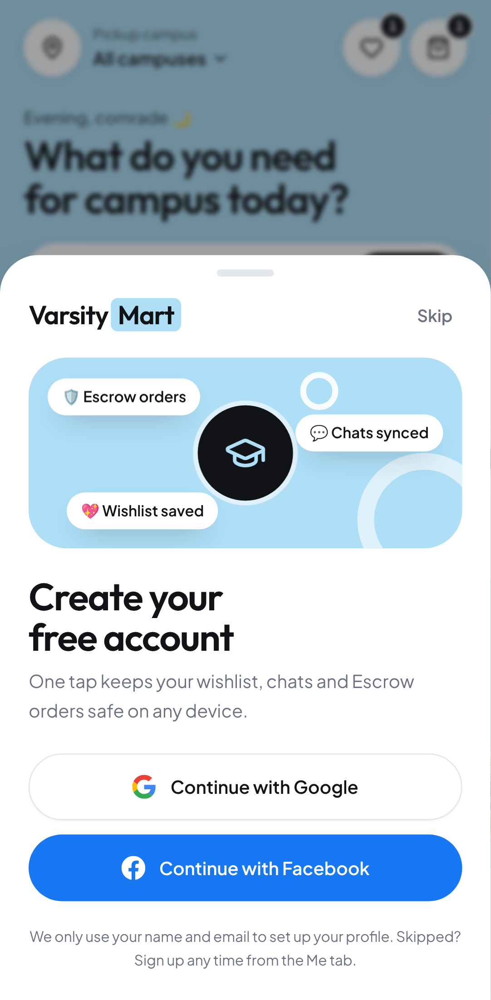
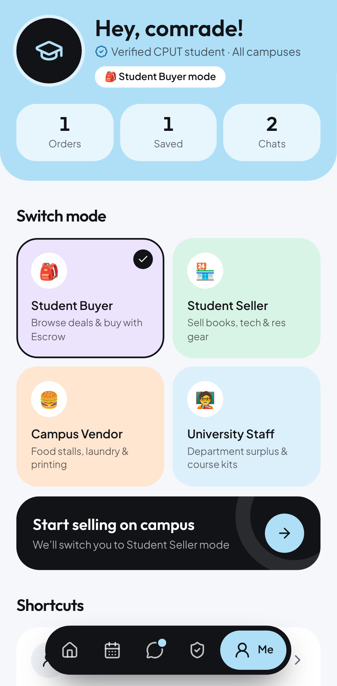
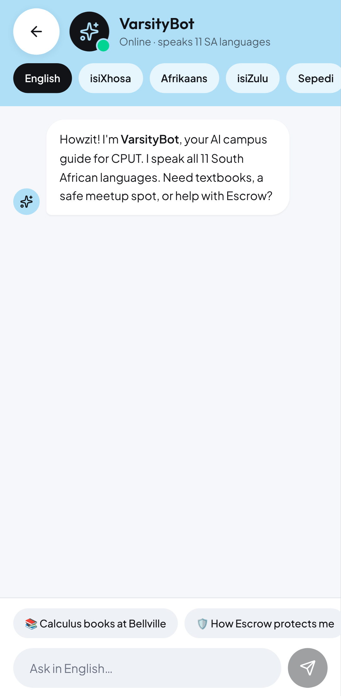
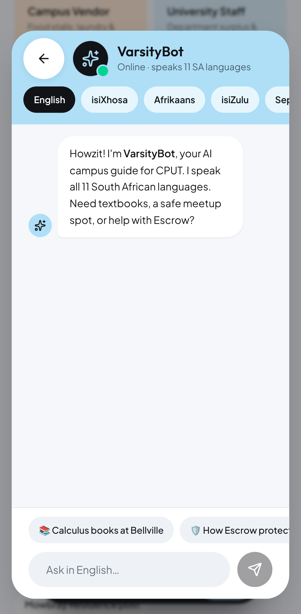

# Varsity Mart

The CPUT campus marketplace app (Capacitor + React) for Android and iPhone.

**Download the latest preview:** <https://github.com/PhakzoSa/Claude/releases>

| File | Install |
| --- | --- |
| `VarsityMart-preview.apk` | Android. Uninstall Varsity Mart v1.0 first (it was signed with a different debug key), then open the APK on the phone. |
| `VarsityMart-unsigned.ipa` | iPhone. Apple only runs signed apps: install it with [Sideloadly](https://sideloadly.io) or [AltStore](https://altstore.io), which sign it with your Apple ID, or build `ios/` in Xcode. |
| `VarsityMart-simulator.zip` | iOS Simulator on a Mac: unzip and drag `App.app` onto a running simulator. |

The APK is also committed at [`release/VarsityMart-preview.apk`](release/VarsityMart-preview.apk).

## What's new

▶ [Promo video](docs/media/promo.mp4) · [Phone walkthrough](docs/media/walkthrough.mp4)

- **Sign-up after the tutorial.** When the intro tutorial is skipped or finished, a *Create your free account* sheet pops up with **Continue with Google** and **Continue with Facebook**. It is skippable (Skip, tap outside, Escape or the Android back button). The Me tab shows *Create your account* until the student signs up, then greets them by name and offers *Sign out*.
- **Chats are no longer full screen.** VarsityBot and the phone conversation view open as a floating card inset from the screen edges; tap outside to close.
- **Centred message box.** The composer row is centred (max 672px) with 6% padding on the left and right; quick replies and messages use the same gutter.
- **Desktop fix.** The desktop conversation column no longer runs past the right edge of the window (a v1.0 bug caused by long quick-reply chips).
- **iPhone build.** `ios/` is a Capacitor 8 Xcode project, built on macOS by GitHub Actions.

| Tutorial → sign-up | Sign-up later from Me | VarsityBot before | VarsityBot after |
| --- | --- | --- | --- |
|  |  |  |  |

More in [`docs/media/`](docs/media): `walkthrough.mp4` (a real recording of the new flow), `promo.mp4` and all screenshots.

## Going live with Google and Facebook sign-in

Until credentials are configured the sign-up buttons run in **demo mode**: they save a placeholder account and the welcome toast says "(demo)". The app already calls [`@capgo/capacitor-social-login`](https://github.com/Cap-go/capacitor-social-login) when the native plugin is present and `socialLoginConfig` is filled in:

1. Create a Google OAuth client (Google Cloud console) and a Facebook app (Meta for Developers) for the bundle/package id `com.varsitymart.app`.
2. Add the plugin to the native projects: `npm i @capgo/capacitor-social-login && npx cap sync`, then follow the plugin's Android and iOS setup (Facebook app id strings, URL schemes in `Info.plist`).
3. Put the ids in `socialLoginConfig` in `app/assets/index.js` (`google.webClientId`, `facebook.appId`, `facebook.clientToken`).
4. Rebuild the apps. Shipping to the App Store or TestFlight needs an Apple Developer Program account.

## Project layout

```
app/              The web app (Capacitor webDir). index.js / index.css are the
                  unminified Vite build from the v1.0 APK, with the changes above.
ios/              Xcode project (Capacitor 8, Swift Package Manager)
release/          Prebuilt Android APK
tools/            APK rebuild, media capture and the promo timeline
docs/media/       Screenshots and videos
.github/workflows/ios.yml   macOS build that publishes the downloads
```

The original source project was not available, so `app/` was extracted from `VarsityMart-v1.0.apk` (first commit). If you still have the React/Tailwind source, the changes to port are in `app/assets/index.js`: `SignUpSheet`, `signUpWith`, `socialLoginConfig`, the `account` / `signUpOpen` state in the root component, the `chat` variant of the sheet component with `chatWindowInset`, and the composer class names. The second commit's diff shows exactly what changed.

## Working on it

```sh
npm install
npm run serve                     # http://localhost:5173
```

**Android APK.** `tools/build-apk.sh <original.apk> [out.apk]` swaps `app/` into the original APK and signs it (needs Python 3, a JDK and curl). To install it as an update over v1.0, sign with the keystore that built v1.0:

```sh
KEYSTORE=~/.android/debug.keystore KEYSTORE_PASSWORD=android KEY_ALIAS=androiddebugkey \
  tools/build-apk.sh VarsityMart-v1.0.apk
```

**iPhone.** On a Mac with Xcode 16+: `npx cap sync ios && npx cap open ios`, pick your team under Signing & Capabilities and run. Every push that touches the app also runs `.github/workflows/ios.yml`, which publishes a new pre-release with the IPA, the Simulator build and the APK.

**Screenshots and videos.** `npm i -D playwright`, then `xvfb-run -a node tools/capture-media.js [screenshots|walkthrough|promo]` (ffmpeg required; on macOS drop `xvfb-run -a`).
